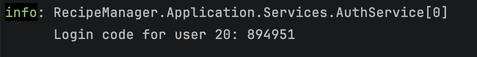
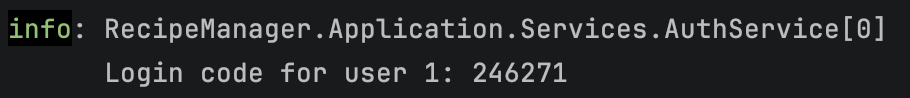

# Application Demo

A visual walkthrough of the Recipe Manager application.

The application is currently demonstrated through recorded local sessions rather than a live deployment.

## Authentication

### 1. Unknown email → Register

When an email that is not associated with an account is submitted on the Login screen, the application shows a registration prompt.

<video controls width="800">
  <source src="./assets/videos/01-unknown-email-register.mp4" type="video/mp4">
</video>

### 2. Registration

A new user can create an account with their first name, last name, email, and optional phone number.

The registration flow also includes requesting and resending the verification code.

<video controls width="800">
  <source src="./assets/videos/02-register.mp4" type="video/mp4">
</video>

<video controls width="800">
  <source src="./assets/videos/02-register-resend-code.mp4" type="video/mp4">
</video>

### 3. Login verification → Explore

An existing user requests a verification code, enters it, and is authenticated into the application.

<video controls width="800">
  <source src="./assets/videos/03-request-code-verify-explore.mp4" type="video/mp4">
</video>

> In the local development environment, the verification code is printed in the API console rather than sent by email.

## Recipes

### 4. Create and manage recipes

Users can browse the shared recipe collection, open recipe details, and create and manage their own recipes.

Recipe creation supports dynamically added ingredient rows.

<video controls width="800">
  <source src="./assets/videos/04-recipes-1-create.mp4" type="video/mp4">
</video>

<video controls width="800">
  <source src="./assets/videos/04-recipes-2-create-full.mp4" type="video/mp4">
</video>

Recipe actions follow ownership rules. Users can manage their own recipes, while shared recipes remain available for viewing.

<video controls width="800">
  <source src="./assets/videos/04-recipes-3-permissions.mp4" type="video/mp4">
</video>

## Favorites

### 5. Add and remove favorites

Users can add recipes to Favorites and remove them again.

<video controls width="800">
  <source src="./assets/videos/05-favorites.mp4" type="video/mp4">
</video>

## Profile

### 6. Profile management

Users can update their first name, last name, and phone number.

<video controls width="800">
  <source src="./assets/videos/06-profile-update.mp4" type="video/mp4">
</video>

Users can also delete their account.

<video controls width="800">
  <source src="./assets/videos/06-profile-delete.mp4" type="video/mp4">
</video>

## Logout

### 7. Logout

Signing out returns the user to the Login screen. Protected areas require an authenticated session.

<video controls width="800">
  <source src="./assets/videos/07-logout.mp4" type="video/mp4">
</video>

## Administration

The application includes a dedicated administration area for users with the Administrator role.

### 8. Admin access

Administrators use the same passwordless authentication flow as regular users.

After authentication, the ADMIN section becomes available in the sidebar with access to Users, Recipes, and Lookups.

<video controls width="800">
  <source src="./assets/videos/08-admin-login.mp4" type="video/mp4">
</video>

### 9. User management

Administrators can view users, change user roles, and delete users.

The application also prevents removing or deleting the last administrator.

<video controls width="800">
  <source src="./assets/videos/09-admin-users.mp4" type="video/mp4">
</video>

### 10. Recipe management

Administrators can manage recipes across the application, including searching by title or author and deleting recipes.

<video controls width="800">
  <source src="./assets/videos/10-admin-recipes.mp4" type="video/mp4">
</video>

<video controls width="800">
  <source src="./assets/videos/10-admin-recipes-search.mp4" type="video/mp4">
</video>

### 11. Lookup management

Administrators can manage Categories, Cuisines, and Ingredients through the lookup section.

Unused lookup values can be deleted, while values that are still referenced by recipes cannot be removed.

<video controls width="800">
  <source src="./assets/videos/11-admin-lookups.mp4" type="video/mp4">
</video>

## Feature coverage

| Area           | Functionality                                          |
| -------------- | ------------------------------------------------------ |
| Authentication | Passwordless login, registration, verification, logout |
| Recipes        | Browse, view, create, edit, delete                     |
| Favorites      | Add and remove favorites                               |
| Profile        | Update and delete account                              |
| Authorization  | User / Administrator roles and ownership rules         |
| Admin          | User, recipe, and lookup management                    |
| Validation     | Protected routes and business-rule validation          |

The application is currently available as a local development demo rather than a live deployment.
